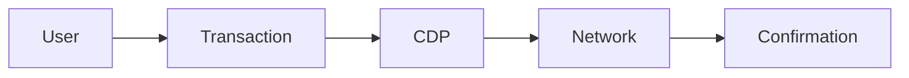

# Cheshire Terminal DeFi Guide

Quick reference for DeFi features and CDP integration.

## 🏦 Morpho Vault

### Quick Actions
```
Connect Wallet → View APY → Deposit → Monitor
```

### Supported Assets
| Asset | Address | Decimals |
|-------|---------|----------|
| ETH   | Native  | 18       |
| USDC  | 0x833589fcd6edb6e08f4c7c32d4f71b54bda02913 | 6 |

### Vault Details
- Address: `0x7BfA7C4f149E7415b73bdeDfe609237e29CBF34A`
- Network: Base
- Gas: Sponsored via CDP
- APY: Variable, auto-compounding

### Deposit Flow
1. Click "Connect Wallet"
2. Select asset (ETH/USDC)
3. Enter amount
4. Click "Deposit"
5. Confirm transaction (gas-free)

### Monitoring
- Real-time balance updates
- APY tracking
- Yield accumulation display
- Total value locked (TVL)

## 💱 Token Swapping

### Quick Actions
```
Select Tokens → Enter Amount → Review → Swap
```

### Supported Pairs
| Pair      | Price Impact Limit |
|-----------|-------------------|
| ETH/USDC  | 1%               |
| USDC/ETH  | 1%               |

### Swap Features
- 0x Aggregator routing
- MEV protection
- Gas sponsorship
- Price impact warnings
- Slippage protection

### Swap Flow
1. Select input token
2. Enter amount
3. View output estimate
4. Check price impact
5. Click "Swap"
6. Confirm (gas-free)

## 🔄 CDP Integration

### Gas Sponsorship


### Limits
| Transaction Type | Daily Limit | Max Gas |
|-----------------|-------------|----------|
| Deposits        | Unlimited   | Auto     |
| Swaps           | Unlimited   | Auto     |
| Approvals       | Unlimited   | Auto     |

### CDP Configuration
```typescript
{
  network: "base-sepolia",
  sponsorship: {
    enabled: true,
    maxGas: "auto",
    contracts: [
      MORPHO_VAULT,
      SWAP_ROUTER
    ]
  }
}
```

## 📊 Transaction Monitoring

### Explorer Links
- Base Explorer: https://basescan.org
- CDP Dashboard: Available in terminal

### Transaction States
| State | Description | Action Required |
|-------|-------------|-----------------|
| Pending | Processing | Wait |
| Confirmed | Successful | None |
| Failed | Error occurred | Retry |
| Sponsored | Gas paid | None |

### Verification
1. Check transaction hash
2. View in explorer
3. Verify CDP sponsorship
4. Confirm asset changes

## 🔐 Security Features

### Transaction Safety
- Contract verification
- Gas sponsorship limits
- MEV protection
- Slippage controls

### Approvals
| Token | Approval Type | Revocation |
|-------|---------------|------------|
| ETH   | Not needed    | N/A        |
| USDC  | Per tx/Infinite| Manual    |

### Best Practices
1. Check addresses
2. Verify amounts
3. Monitor approvals
4. Review gas sponsorship

## 🛠 Troubleshooting

### Common Issues
| Issue | Solution |
|-------|----------|
| Failed Tx | Check CDP status |
| High Slippage | Adjust amount |
| Insufficient Balance | Check wallet |
| Pending Approval | Wait or speed up |

### Support Steps
1. Check transaction status
2. Verify CDP sponsorship
3. Review error messages
4. Contact support if needed

## 📱 Quick Commands

### Vault Commands
```bash
/connect                 # Connect wallet
/balance                # Check balances
/apy                    # View current APY
/deposit [amount]       # Quick deposit
```

### Swap Commands
```bash
/swap [amount] [pair]   # Quick swap
/price [token]         # Check price
/route [pair]          # View route
/impact [amount]       # Check impact
```

### CDP Commands
```bash
/gas                    # Check sponsorship
/verify [tx]           # Verify transaction
/limits                # View CDP limits
/status                # CDP status
```

## 🔄 Updates & Maintenance

### Version Control
- Terminal version
- Contract versions
- CDP integration version

### Upgrades
- Automatic updates
- Security patches
- Feature additions

### Monitoring
- APY changes
- Gas prices
- Price impacts
- CDP status

## 📞 Support Channels

### Help Resources
1. In-terminal help
2. Documentation
3. Support chat
4. Community forums

### Emergency Contacts
- Technical support
- CDP support
- Security team

Remember: All transactions are gas-free thanks to CDP integration. Always verify transaction details before confirming.
